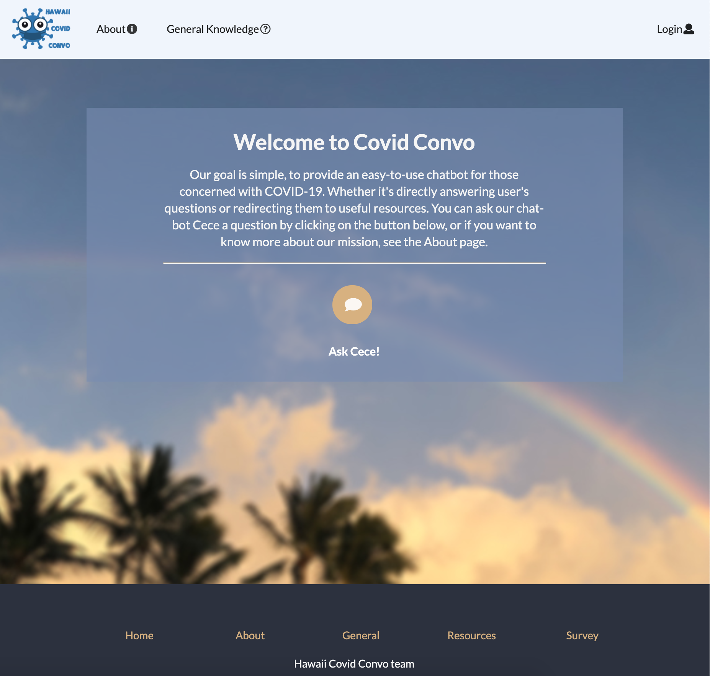
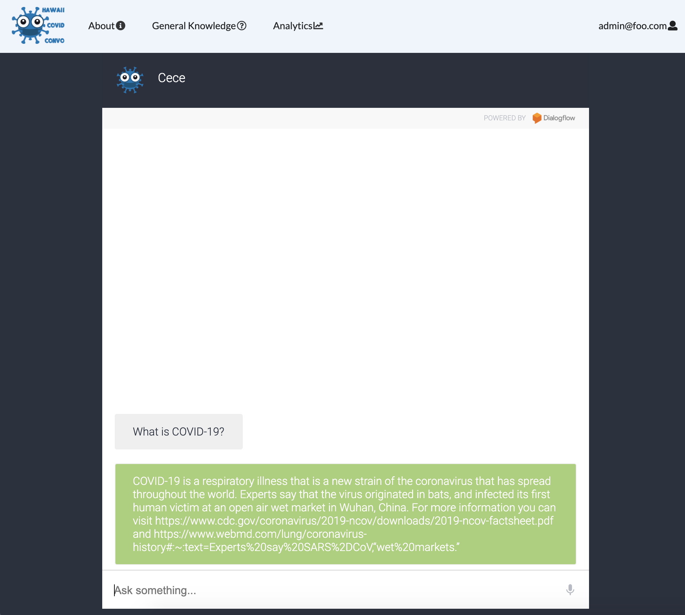
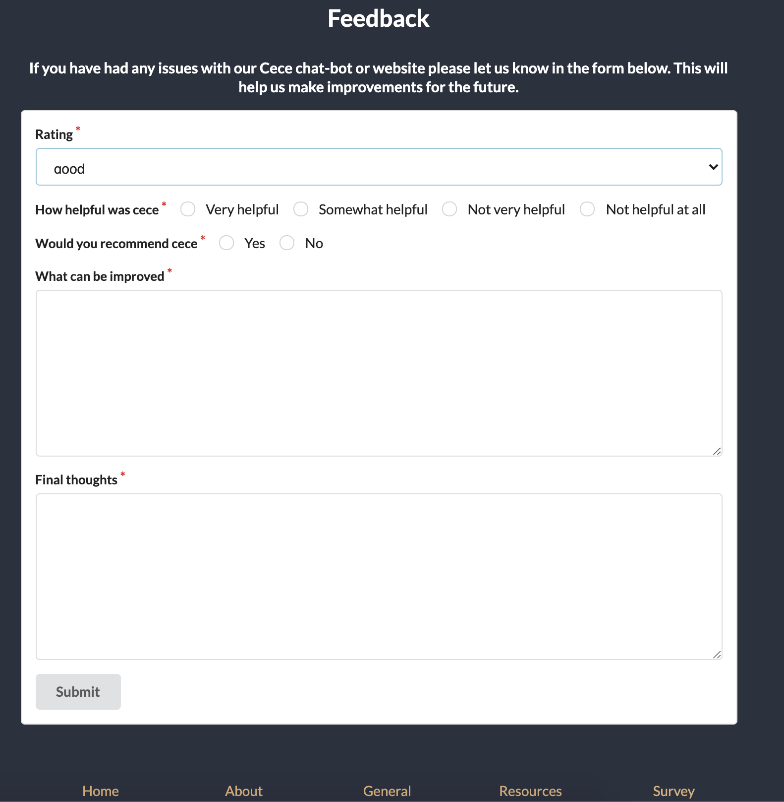
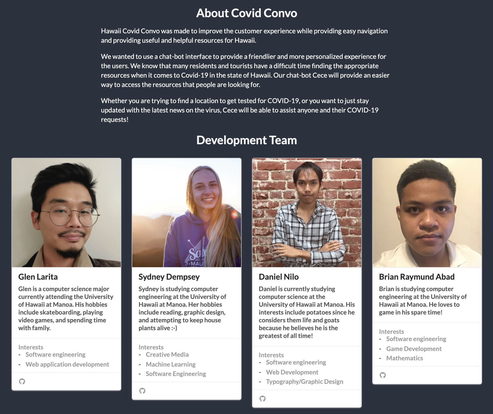
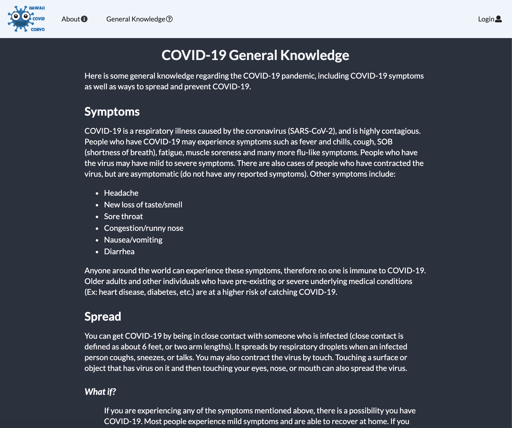
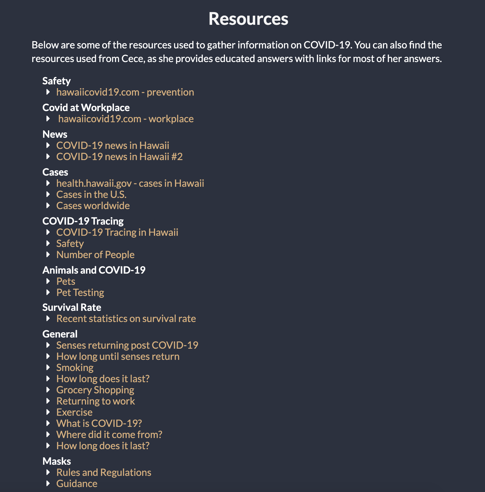
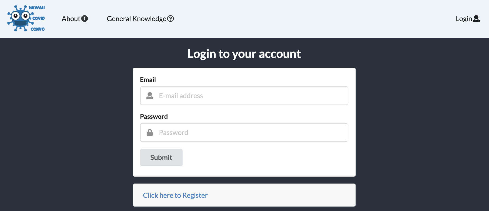
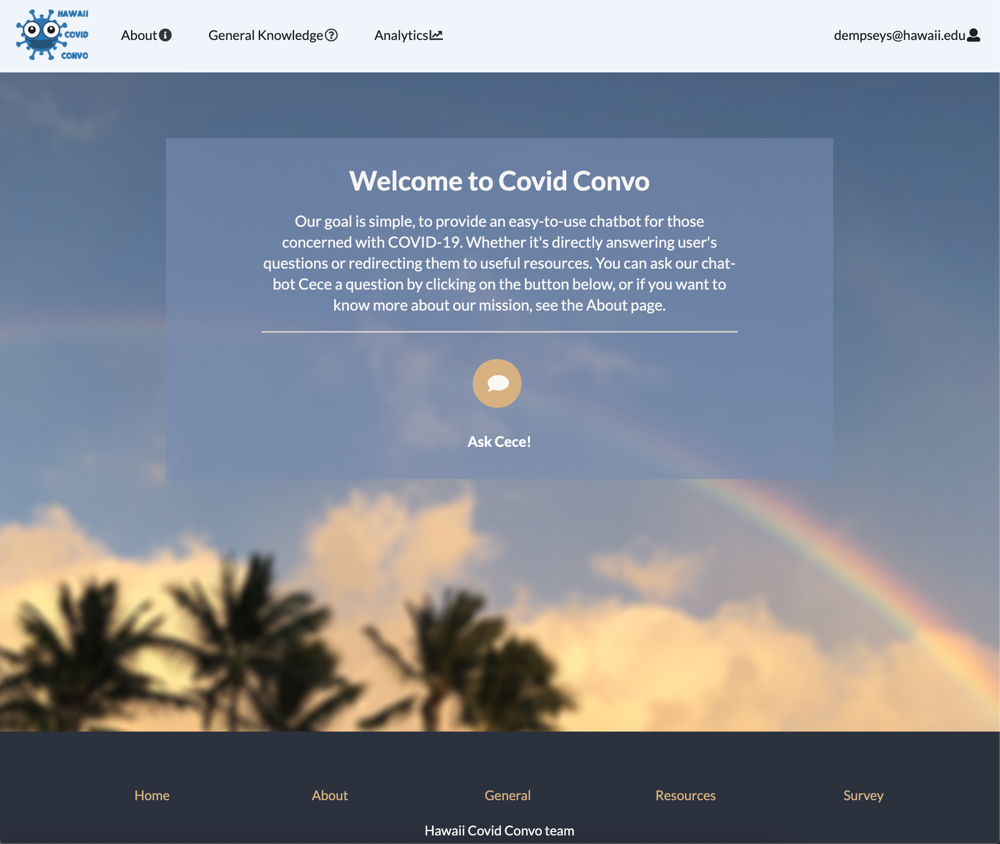
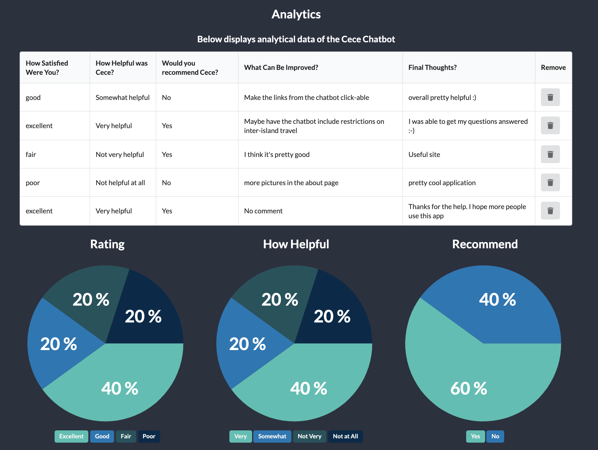
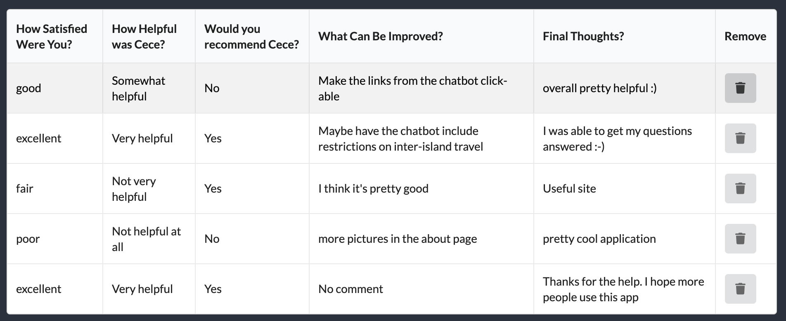

# Table of Contents

* [Overview](#overview)
* [Deployment](#deployment)
* [Goal](#goal-of-the-application)
* [User Guide](#user-guide)
* [Developer Guide](#developer-guide)
* [Community Feedback](#community-feedback)
* [Development History](#development-history)
* [Contact Us](#contact-us)

# Overview
Welcome to HI-Covid-Convo! The goal of this project is simple. We're aiming to provide an easy-to-use chat-bot for those concerned with COVID-19. Whether it's directly answering user's questions, or redirecting them to useful resources, we hope to give all users peace of mind.
[To hi-covid-convo organization](https://github.com/hi-covid-convo)

# Deployment
Here is a [link](https://cece-convo.xyz/) to our deployed site!

# Goal of the Application
Our goal for this project was to have a working chat-bot that will be able to answer COVID-related FAQs while providing easy-to-use navigation and functionality for the user. Along with being able to parse user input and determine the best response/resource to provide to the user, we also wanted to include other resources on the site that will provide general information on COVID and how to remain safe during this pandemic. Because we want the site to remain anonymous, we collect feedback from users who use the chatbot anonymously. This feedback is displayed as analytics and includes data such as the rating of the chatbot, how helpful it was, and how it can be improved, as well as how happy users are with the quality of the responses. These analytics would be available to an admin user once logged into the application.

# User Guide
## Our Current Progress..

## Landing Page
Users will first be taken to the landing page which will give an overview of the application while making the user feel welcomed with a background image of the Hawaiian sky. There is also a button to take the user to Cece, the COVID-19 chatbot. This page also discusses the goal for this application, and directs the user to go to the About and general knowledge page if they wish to learn more.


You can view our landing page [here](https://cece-convo.xyz/#/).


## Cece the Chatbot
The chat icon button on the landing page will then take users to the Cece chatbot page. The page has a brief introduction to our chatbot Cece and some brief  instructions on how to use it. There is also a survey link to take users to the feedback form.


On the bottom of the page is where the user will be able to enter in a question regarding COVID-19, and the chatbot will provide them an answer. Our chatbot has been configured to answer more than 50 different questions!


You can view our Cece Chatbot page [here](https://cece-convo.xyz/#/Cece).

### Questions Currently Accepted by Cece
* What is COVID?
* Can I catch COVID again?
* How long until I’m COVID free?
* Am I at risk if I smoke?
* Is it safe to go to work?
* Is it safe to go to the grocery store?
* Safest way to exercise?
* Can animals get COVID?
* Should I get my pet tested?
* When will my taste / sense of smell come back?
* What are common COVID symptoms?
* What are dangerous COVID symptoms?
* When should I go to the hospital?
* When will COVID end?
* What is the survival rate?
* Can I get a vaccine?
* When will vaccines become available?
* How much will a vaccine cost?
* Will there be enough vaccines for everyone?
* If I've already had COVID, do I still need a vaccine?
* How many shots of the vaccine will be needed?
* How is COVID spread?
* How effective is wearing a mask?
* What kind of masks do you recommend?
* Where can I purchase a mask?
* What disinfectants kill COVID?
* Who is most at risk?
* I came into contact with someone who tested positive, what do I do?
* Can I get COVID from ordering food?
* How many cases are there in Hawaii?
* How many cases are there in the United States?
* How many cases are there on Oahu?
* How many cases are there on Maui?
* How many cases are there on BigIsland?
* How many cases are there worldwide?
* What should I expect when I get tested?
* Where can I get tested on {Insert Island}?
* How many different types of tests are there?
* When should I expect test results?
* When should I get tested?
* When is the best time to travel?
* How can I travel safely?
* Should I get tested before traveling?
* What is the recommended safe limit of the number of people you can gather with?
* Can I have friends over for dinner?
* Will drinking alcohol prevent COVID? 

#### Bonus Questions
* Why was all of the toilet paper gone?
* When will I be able to buy clorox wipes again?
* Will 2021 be better than 2020?
* What is the best class at UH Manoa?

## Feedback Form
After clicking on the survey link from the Cece page, users will be taken to a form where they can submit their feedback on the application. All forms submitted will be shown in the analytics page.




## About Page
If the user wants to learn more about our application and its goal, they can visit the About page via the navigation bar. In this page we briefly go over what our goal is, and our purpose for creating this application.


You can view our About page [here](https://cece-convo.xyz/#/about).


## General COVID Info Page
The General knowledge page provides the user some general knowledge information about COVID-19. This includes topics like symptoms of the virus, how it is spread, and prevention and protection. This information was gathered from the [Centers for Disease Control and Prevention (CDC)](https://www.cdc.gov/coronavirus/2019-ncov/index.html). The General knowledge page is currently still in progress, and we are looking forward to adding more information on this page for the user to view. 


You can view our General Knowledge page [here](https://cece-convo.xyz/#/general).

## Resources Page
If the user wants to learn where we got the information used for the chatbot, they can navigate to the Resources page via the footer.



You can view our Resources page [here](https://cece-convo.xyz/#/resources).

## User Log-in
Users that create an account in our application will have access to the analytical data of the user feedback regarding our chat-bot and application.


You can view the User login page [here](https://cece-convo.xyz/#/signin).

## User Home Page
Once logged in, the user will now have a new menu item in the navigation bar called "analytics". This menu item will link the user to an analytics page, where all the user feedback data of the site will be displayed.


You can view the user Home page [here](https://cece-convo.xyz/#/). Please note that in order to view this page you must have an account created on our application and you must be logged into that account. 

## Analytics Page
The user is then brought to the analytics page after clicking on the navigation bar link. This page will display analytical data regarding user feedback on how helpful the chat-bot was, and any additional improvements or thoughts they have on the application. We implement this data by having our application display this information after the user fills out a form when they have finished using the chat-bot. Ratings and feedback data are displayed using a table and three different pie charts.



Users can also delete feedback responses. Clicking the trash can icon will remove the entire response and update the pie charts below the table.




You can view our Analytics page [here](https://cece-convo.xyz/#/analytics). Please note that in order to view this page you must be logged in on the application.

# Developer Guide
 
First, [install Meteor](https://www.meteor.com/install):

Second, download a copy of [Hi-Covid-Convo](https://github.com/hi-covid-convo/hi-covid-convo) from Github.

Third, open up your terminal/command prompt and cd into the app directory of the Hi-Covid-Convo copy you had just downloaded
and install the necessary libraries by invoking meteor npm install:

```
$ meteor npm install
```

You must also install a pie chart library since our application will be using pie charts to display analytics. If this is not installed, then you won't be able to view the application. 

To do this, you can install the following libraries:

```
$ npm install underscore
````

and 

``` 
$ npm install react-minimal-pie-chart
```

After the libraries are installed, you can run the application by typing in the command:

```
$ meteor npm run start
```


The first time you run the app, it will create some default users that have been added to the database. Here is an
example of how the output may look:

```
I20201119-23:01:44.024(-10)? Creating the default user(s)
I20201119-23:01:44.024(-10)?   Creating user admin@foo.com.
I20201119-23:01:44.332(-10)?   Creating user john@foo.com.
I20201119-23:01:44.754(-10)? Monti APM: completed instrumenting the app
=> Started your app.
```

Note regarding bcrypt warning: You may also get a similar message when running this application:

```
=> Started proxy.                             
=> Started MongoDB.                           
W20201119-22:58:19.472(-10)? (STDERR) Note: you are using a pure-JavaScript implementation of bcrypt.
W20201119-22:58:19.515(-10)? (STDERR) While this implementation will work correctly, it is known to be
W20201119-22:58:19.516(-10)? (STDERR) approximately three times slower than the native implementation.
W20201119-22:58:19.516(-10)? (STDERR) In order to use the native implementation instead, run
W20201119-22:58:19.516(-10)? (STDERR) 
W20201119-22:58:19.516(-10)? (STDERR)   meteor npm install --save bcrypt
W20201119-22:58:19.516(-10)? (STDERR) 
W20201119-22:58:19.517(-10)? (STDERR) in the root directory of your application.
I20201119-22:58:20.471(-10)? Monti APM: completed instrumenting the app
=> Started your app.
```

On some operating systems (particularly Windows), installing bcrypt is much more difficult than implied by the above
message. Bcrypt is only used in Meteor for password checking, so the performance implications are negligible until your
site has very high traffic. You can safely ignore this warning without any problems during initial stages of
development.

If all goes well, the template application will appear at http://localhost:3000. You can login in using the credentials
in setting.development.json, or else you can register an new account.

Lastly, you can run ESLint over the code in the imports/directory with:

```
$ meteor npm run lint
```

# Community Feedback
Current users who reviewed the deployed site found that the chatbot would provide an answer for a different question. To fix the problem, we adjusted the training phrases so the chatbot would provide the correct answer. Other improvements that will shape future work on the application include:
* Making the links provided by the chatbot clickable
* Including a popup button for the chatbot that can be accessed on any page
* Adding in the ability to answer financial and unemployment questions
* Adding photos to the general knowledge page in replacement of text to make it more interesting


We're interested in your experience and would love to receive more feedback for future development of the application. If you're interested in helping, please take a few minutes to fill out [this form](https://forms.gle/Z9ALwHkicNkG6KU9A).


# Development History

If you would like to view our project history, as well as the completed issues from our First Milestone, view [HI Covid Convo M1](https://github.com/hi-covid-convo/hi-covid-convo/projects/1).

If you would like to view the issues and project history for the Second Milestone, view [Hi Covid Convo M2](https://github.com/hi-covid-convo/hi-covid-convo/projects/2)
During this milestone we implemented a form created for user feedback and displayed the statistics of that form in an analytics page that users with accounts may see. We also made adjustments to the visual design of the application with the goal of embracing the aloha spirit of Hawaii. We successfully configured our chat-bot Cece to answer up to fifty different questions regarding COVID-19, which will provide information and links to websites that users may find informative and useful.

To see the final issues and project issues for the Third Milestone, view [Hi Covid Convo M3](https://github.com/hi-covid-convo/hi-covid-convo/projects/3) In the final revisions to the project, we added in a page to show the resources used to generate the answers from the chat-bot. We also updated the about page, and made the web-app more navigational by including more links in the footer. To better the functionality of the chat-bot, we revised the intents and phrases on DialogFlow.


# Contact us
If you would like to contact the creators of HI Covid Chatbot, you can email us at the below addresses:

[Glen Larita](https://glarita.github.io/) - glarita@hawaii.edu

[Daniel Nilo](https://duhkneelow.github.io/) - dnilo@hawaii.edu

[Brian Abad](https://ba-bbage.github.io/) - babad8@hawaii.edu

[Sydney Dempsey](https://sydempsey.github.io/) - dempseys@hawaii.edu

