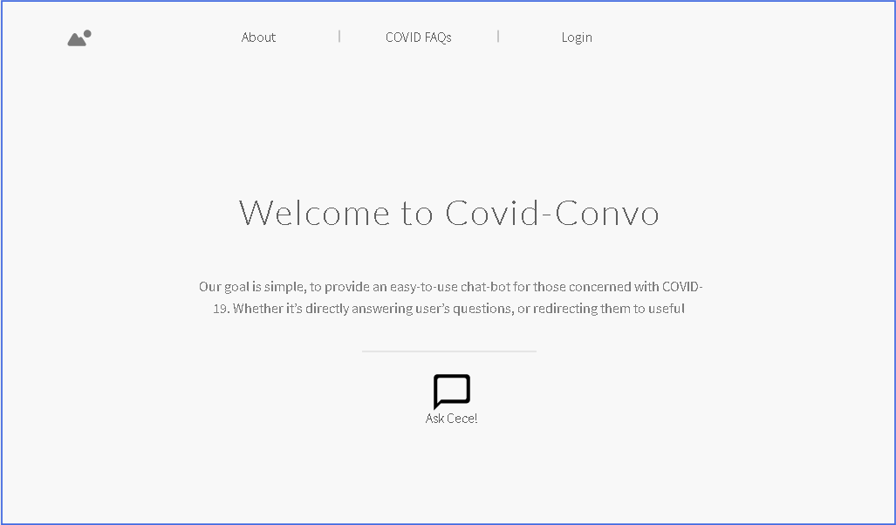
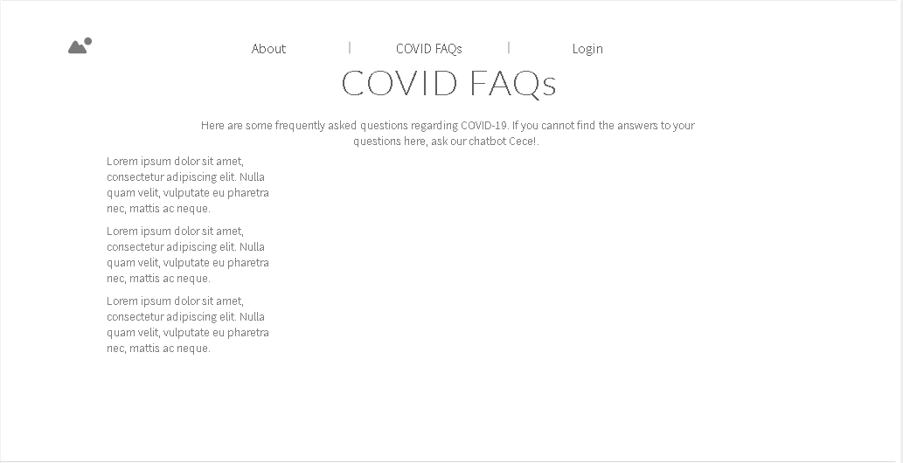
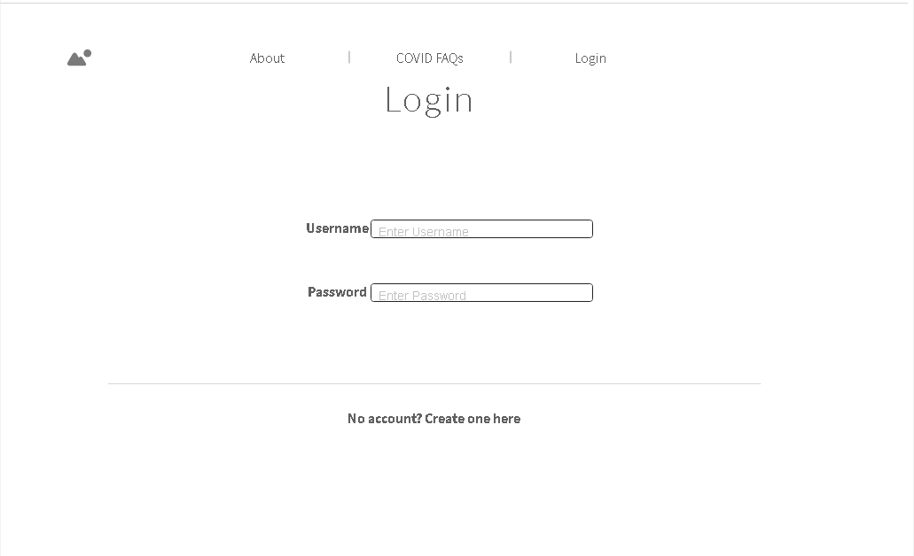
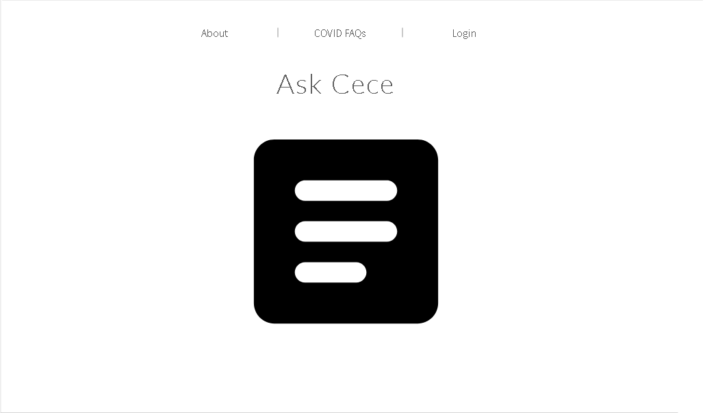

## Welcome to HI Covid Convo!
The goal of this project is simple. We're aiming to provide an easy-to-use chat-bot for those concerned with COVID-19. Whether it's directly answering user's questions, or redirecting them to useful resources, we hope to give all users peace of mind.
[To hi-covid-convo repo](https://github.com/hi-covid-convo/hi-covid-convo)

## Final Outcome of the Application
Over the next month, we plan to improve upon the applications functionality. By the end, our goal is to have a working chat-bot that will be able to answer COVID-related FAQs. Along with being able to parse user input and determine the best response/resource to provide, we also would like to include other resources on the site that will provide general information on COVID and how to remain safe during this pandemic. Because we want the site to remain anonymous, we plan to collect feedback statistics from users who use the chatbot. These statistics would include the most commonly asked questions, as well as how happy users are with the quality of the responses. These statistics would be available to an admin user once logged into the application.

## Team Members
[Glen Larita](https://glarita.github.io/)

[Daniel Nilo](https://duhkneelow.github.io/)

[Brian Abad](https://ba-bbage.github.io/)

[Sydney Dempsey](https://sydempsey.github.io/)

## Mock-Up Pages
Below are some low-fidelity mockups

### Landing Page Mock-Up

### FAQ Page Mock-Up

### Admin Login Page Mock-Up

### Ask CECE Page Mock-Up

